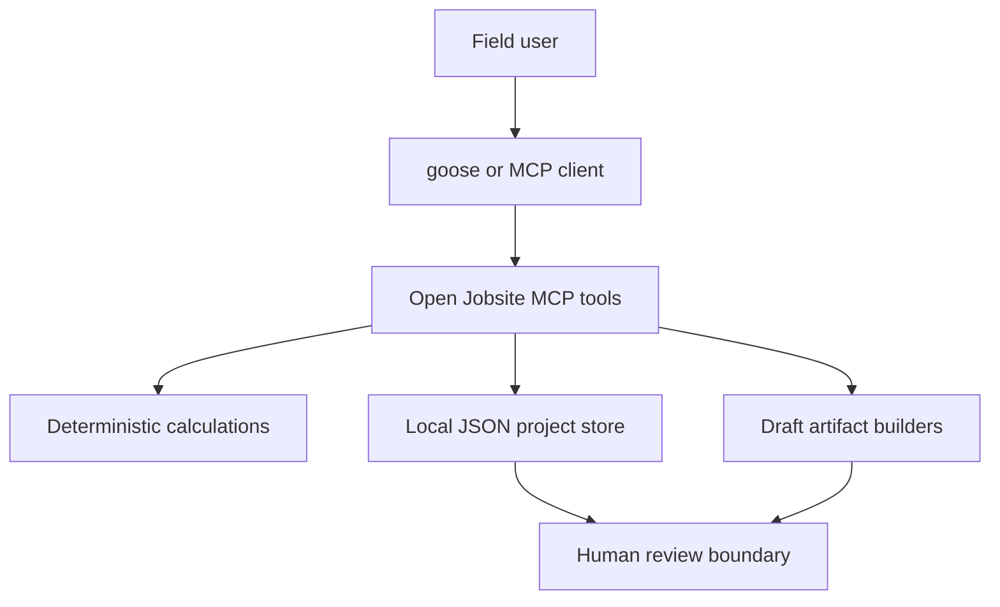

# Architecture

Open Jobsite separates deterministic domain logic from transport and future model
capabilities.

## Components

- `calculations.py` performs unit math with `Decimal` and no I/O.
- `artifacts.py` builds daily logs, estimates, and change orders. It marks them as
  drafts and records unit math, assumptions, exclusions, and evidence IDs.
- `store.py` validates project identifiers and atomically writes local JSON.
- `server.py` provides a small MCP surface. It converts portable JSON-string
  arguments to typed core calls and saves only local state.
- `skills/` tells an agent how to gather inputs, call tools, and stop for review.

## Data model v0.1

A project contains metadata, `evidence[]`, and `artifacts[]`. Evidence includes a
source reference and one publication status: `private`, `synthetic`, or
`permission_cleared`. Artifacts can link only to evidence IDs in the same project.

The initial schema lives in code and examples while real workflows are tested.
Before v0.2 it will be extracted to versioned JSON Schema files with migrations.

## Trust boundaries

The MCP client/model may suggest inputs, but deterministic code calculates totals.
Open Jobsite does not assert that measurements, source notes, prices, or contract
interpretations are true. The user must review the complete draft before any
message, quote, signature, purchase, or site instruction occurs in another
system.

## Portability

The server uses MCP stdio and local files. Core functions do not depend on goose,
a model vendor, a construction SaaS account, or a network connection. Future
adapters must remain optional and declare their external data flow.
